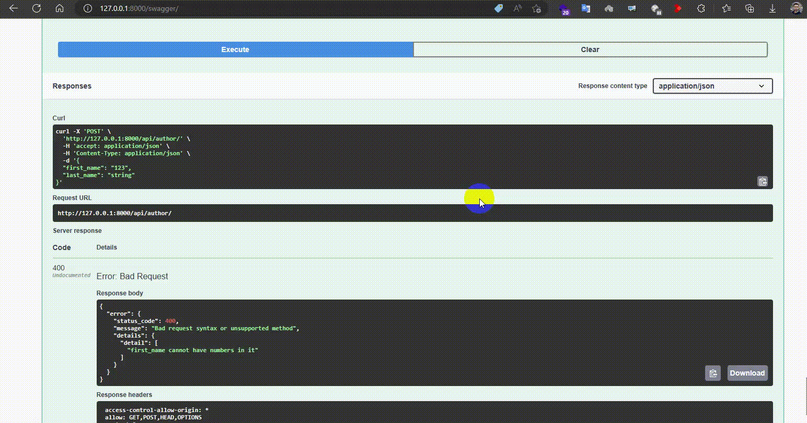

<div align="center">

<h1 align="center">Django Multi-Language Sample</h1>
<h3 align="center">Sample Project to show you how to implement multi language in django</h3>
</div>
<p align="center">
<a href="https://www.python.org" target="_blank">  </a>
<a href="https://www.djangoproject.com/" target="_blank">  </a> 
<a href="https://www.docker.com/" target="_blank">  </a>
<a href="https://www.postgresql.org" target="_blank">  </a>
<a href="https://git-scm.com/" target="_blank">  </a>
</p>

# Guideline
- [Guideline](#guideline)
- [Goal](#goal)
- [Development usage](#development-usage)
  - [Clone the repo](#clone-the-repo)
  - [Enviroment Varibales](#enviroment-varibales)
  - [Build everything](#build-everything)
  - [Note](#note)
  - [Check it out in a browser](#check-it-out-in-a-browser)
- [Internationalization vs Localization](#internationalization-vs-localization)
- [Setup](#setup)
- [Define what needs translation](#define-what-needs-translation)
- [Creating the locale](#creating-the-locale)
- [API Test](#api-test)
- [Template Test](#template-test)
- [License](#license)
- [Bugs](#bugs)

# Goal
This project main goal is to provide a sample to show you how to implement multi language django.

# Development usage
You'll need to have [Docker installed](https://docs.docker.com/get-docker/).
It's available on Windows, macOS and most distros of Linux. 

If you're using Windows, it will be expected that you're following along inside
of [WSL or WSL
2](https://nickjanetakis.com/blog/a-linux-dev-environment-on-windows-with-wsl-2-docker-desktop-and-more).

That's because we're going to be running shell commands. You can always modify
these commands for PowerShell if you want.


## Clone the repo
Clone this repo anywhere you want and move into the directory:
```bash
git clone https://github.com/AliBigdeli/Django-MultiLanguage-Sample.git
```

## Enviroment Varibales
enviroment varibales are included in docker-compose.yml file for debugging mode and you are free to change commands inside:

```yaml
services:
  backend:
  command: sh -c "python manage.py check_database && \ 
                      yes | python manage.py makemigrations  && \
                      yes | python manage.py migrate  && \                    
                      python manage.py runserver 0.0.0.0:8000"
    environment:      
      - DEBUG=True
```


## Build everything

The first time you run this it's going to take 5-10 minutes depending on your
internet connection speed and computer's hardware specs. That's because it's
going to download a few Docker images such as minio and build the Python + requirements dependencies. and dont forget to create a .env file inside dev folder for django and postgres with the samples.

```bash
docker compose up --build
```

Now that everything is built and running we can treat it like any other Django
app.

## Note

If you receive an error about a port being in use? Chances are it's because
something on your machine is already running on port 8000. then you have to change the docker-compose.yml file according to your needs.


## Check it out in a browser

Visit <http://localhost:8000> in your favorite browser.


# Internationalization vs Localization
Internationalization and localization represent two sides to the same coin. Together, they allow you to deliver your web application's content to different locales.

- **Internationalization**, represented by i18n (18 is the number of letters between i and n), is the processing of developing your application so that it can be used by different locales. This process is generally handled by developers.
- **Localization**, represented by l10n (10 is the number of letters between l and n), on the other hand, is the process of translating your application to a particular language and locale. This is generally handled by translators.

**Note:** For more, review Localization vs. Internationalization from W3C.

# Setup
in order to have multi lang support in your project, you need to first have the gettext module installed on the running os. as we are using docker as our environment and specially python image we have integrated installation in dockerfile by default:

```dockerfile 
# adding gettext package
RUN apt-get update
RUN apt-get install gettext -y
RUN apt-get clean
RUN rm -rf /var/lib/apt/lists/*
```

other than that there is no need to install anything else except adding some settings to the project. first of all you need to add the locale to the middleware and after that define the list of languages that you need in your project, and finally set the directory for managing locales.

```python
# adding additional languages support
from django.utils.translation import gettext_lazy as _
LANGUAGES = (
    ('en', _('English')),
    ('fa', _('Farsi')),
)
LOCALE_PATHS = [
    BASE_DIR / 'locale/',
]
MIDDLEWARE += [
    "django.middleware.locale.LocaleMiddleware",
]
```
**Note:** you might be using something else, so my case are the ones i use for this sample app.

# Define what needs translation
where ever in you project that you need translation for incoming messages you can simple set it by putting the text inside the gettext function which mostly import it like this:
```python
from django.utils.translation import gettext_lazy as _
```
and this is one sample of using it inside your code:
```python
from rest_framework import serializers
from rest_framework.exceptions import ValidationError
from ..models import Author
from django.utils.translation import gettext_lazy as _

class AuthorSerializer(serializers.ModelSerializer):
    
    class Meta:
        model= Author
        fields = ['first_name','last_name']
        
        
    def validate(self, attrs):
        if attrs.get("first_name").isdigit():
            raise serializers.ValidationError({"detail":_("first_name cannot have numbers in it")})
        return super().validate(attrs)
```
that as you can see the message 'first_name cannot have numbers in it' will set as a text that can have translation.
**Note:** you can do this almost everywhere that you need.


# Creating the locale
after setting up and making your texts ready you need to create the messages you need for your language.
so first of all use the command bellow to create the file for ```fa``` language.
```shell
python manage.py makemessages --ignore="static" --ignore=".env" -l fa 
```
you can use the following command to create it for all of the languages in the list but before that you have to create a folder dedicated to each language in locale directory.
second use the 
```shell
python manage.py makemessages --ignore="static" --ignore=".env" --all
```

now head to the file you created and open it, you have to see something like this:

```python
# SOME DESCRIPTIVE TITLE.
# Copyright (C) YEAR THE PACKAGE'S COPYRIGHT HOLDER
# This file is distributed under the same license as the PACKAGE package.
# FIRST AUTHOR <EMAIL@ADDRESS>, YEAR.
#
#, fuzzy
msgid ""
msgstr ""
"Project-Id-Version: PACKAGE VERSION\n"
"Report-Msgid-Bugs-To: \n"
"POT-Creation-Date: 2023-02-25 12:14+0000\n"
"PO-Revision-Date: YEAR-MO-DA HO:MI+ZONE\n"
"Last-Translator: FULL NAME <EMAIL@ADDRESS>\n"
"Language-Team: LANGUAGE <LL@li.org>\n"
"Language: \n"
"MIME-Version: 1.0\n"
"Content-Type: text/plain; charset=UTF-8\n"
"Content-Transfer-Encoding: 8bit\n"
"Plural-Forms: nplurals=2; plural=(n > 1);\n"

#: core/settings.py:271
msgid "English"
msgstr ""

#: core/settings.py:272
msgid "Farsi"
msgstr ""

#: templates/website/index.html:20
msgid "Welcome to my Website"
msgstr ""

#: website/api/serializers.py:15
msgid "first_name cannot have numbers in it"
msgstr ""

```
as you see there are two keys:
- msgid: the message you wanted it to be changed
- msgstr: the definition of the message 

now go ahead and put the meanings like what i had:

```python
#: core/settings.py:271
msgid "English"
msgstr "انکلیسی"

#: core/settings.py:272
msgid "Farsi"
msgstr "فارسی"

#: templates/website/index.html:20
msgid "Welcome to my Website"
msgstr "به وبسایت من خوش آمدید"

#: website/api/serializers.py:15
msgid "first_name cannot have numbers in it"
msgstr "نام نمی تواند حاوی عدد باشد"

```


python manage.py compilemessages --ignore=env -l fa

# API Test
in order to test the usage in api you have to set a specific header for any language that you define to get the results. for example for **fa** you need to add the following header to your request.
```
Accept-Language : fa
```
you can do this inside postman or use a mod header extension.

sample test to see general changes of messages for authentication as sample:

<div align="center"></div>

sample test to see custom message changes for authentication as sample (serializer):

<div align="center"></div>


# Template Test
for testing the multi language inside the template i have provided you a sample for a simple header. as you see i am listing all the available languages in the nave bar plus adding the tags it needs to fetch these languages.

```html


<li class="nav-item dropdown">
    <a class="nav-link dropdown-toggle text-white" href="#" id="navbarDropdown" role="button"
        data-bs-toggle="dropdown" aria-expanded="false">
        Language
    </a>
    <ul class="dropdown-menu" aria-labelledby="navbarDropdown">
        
        
        

        
        <li>
            <a class="dropdown-item" href="/{{ lang.code }}/">
                {{ lang.name_local }}
            </a>
        </li>
        
    </ul>
</li>

```
now you can see the list of languages based on what you have created, also if you select each language the text will change accordingly

<div align="center"></div>

notice the url is changing accordingly too.

**Note:** you can do this also in the view too.


# License
MIT.


# Bugs
Feel free to let me know if something needs to be fixed. or even any features seems to be needed in this repo.
